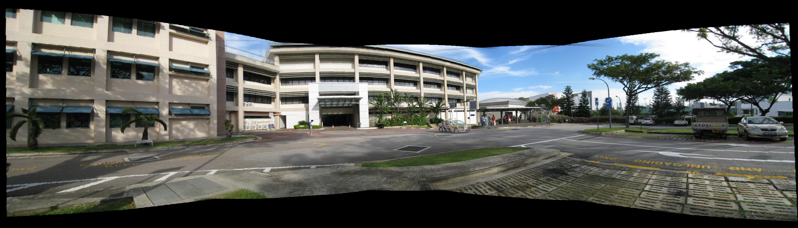
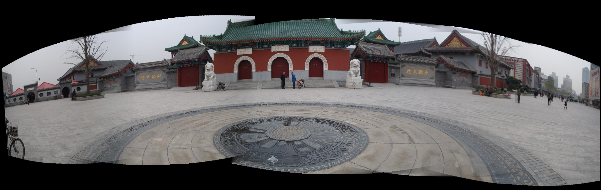
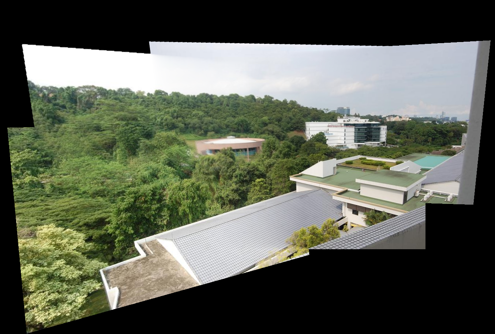

# EE-666: Assignment 3 - Panaroma Stitching

## Given a set of images, Find Homography matrices and stitch images to make a Panaroma.

### Concepts used:

- SIFT Feature Detection and Matching
- Robust Homogrpahy Estimation using RANSAC
- Image Warping, Blending and Stitching
- Cylindrical Warping (special case)
 
### Stitching Results

